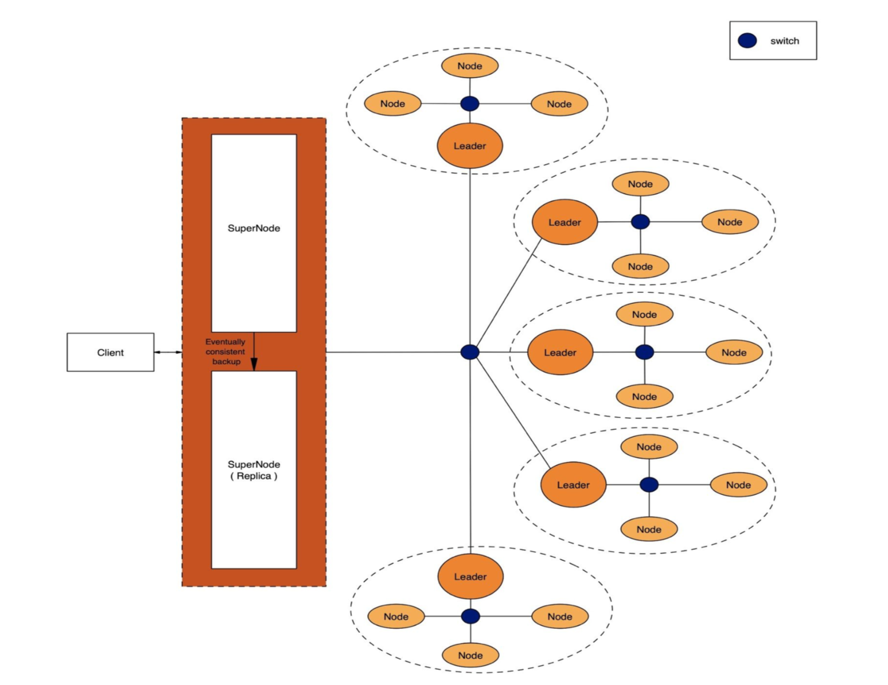
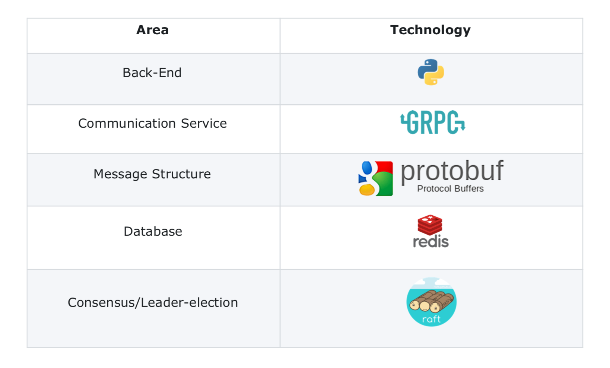

# Distributed File Storage

Project Fluffy is an open-source, scalable, decentralized, robust, heterogeneous file storage solution which ensures that multiple servers can inter-operate to form a dynamic ‘overlay’ fabric.
The system supports some important design aspects such as -
- Language Agnostic
- System failure & recovery
- Work-stealing algorithms
- Scalability
- Robustness
- Queues to serve multiple requests simultaneously
- Cluster Consensus (RAFT)
- Data Replication
- Caching Optimization
- Efficient Searching
 
The following user services are currently supported (with an option to modularly add new services at any time) - 
 
    > File Upload (supports any file type - pdf, img, avi, txt, mp4, xml, json, m4v, etc.)
    > File Download
    > File Search
    > File List (Lists all files on the system that belong to a specific user)
    > File Delete
    > File Update
  
This system allows many clients to have access to data and supports operations (create, delete, modify, read, write) on that data. Each data file is partitioned into several parts called chunks. Each chunk is stored on different remote machines, facilitating the parallel execution of applications.

### Architecture Diagram

### Technology Stack

